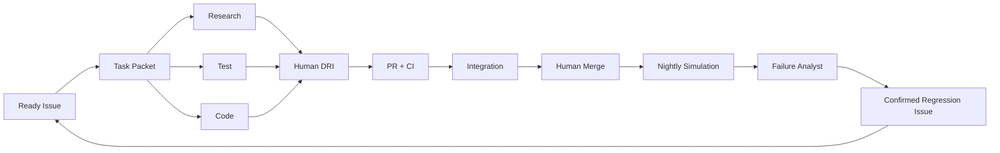

# Workbench-1 AI 原生工程手册

> 版本：1.1  
> 日期：2026-08-04  
> 范围：Robot Runtime + AI Engineering Factory  
> 人类团队：每个模块一名负责人  
> 核心原则：AI 加速学习循环；人类保留责任。

## 1. 为什么需要这本手册

项目已经有很多技术角色。风险不在于缺少 AI 工具，而在于不受约束的 AI 使用会制造互相冲突的代码、无法验证的声明、泄露的上下文和更多的人类工作量。

因此 Workbench-1 有两个平面：

| 平面 | 目的 | AI 权限 |
|---|---|---|
| Robot Runtime | 感知、建模、规划、行动、验证、恢复与表达状态 | 仅限语义建议；确定性安全与验证优先 |
| AI Engineering Factory | 把 Issue 变成代码、测试、场景、失败报告与发布证据 | 仅在人类批准的任务包内读写 |

目标结果不是“更多的 Agent”，而是：

```text
observe failure -> ground evidence -> confirm defect -> create regression
-> propose fix -> human review -> CI -> retain test
```

## 2. AI 成熟度目标

| 当前的弱模式 | Workbench-1 目标 |
|---|---|
| 把整个计划粘贴进每个提示词 | 带 Persist/Retrieve/Exclude 边界的上下文清单 |
| 一个巨型 agent 提示词 | 带明确交接与允许路径的小型 agent |
| AI 写个功能然后说它可用 | AI 产出代码、测试、命令与证据；人类 DRI 验收 |
| 随机的模拟器演示 | 固定种子的 schema 校验场景清单 |
| 模型无证据地解释失败 | 失败报告引用事件、日志、版本与未知项 |
| LLM 判定物理成功 | 传感器、几何、状态机与测试判定物理成功 |
| 成功截图就是结果 | 原始事件、指标、回放与失败样本才是结果 |

## 3. 事实来源上下文

### 3.1 仓库文件

```text
AGENTS.md                         Always-loaded repository rules
docs/context/CONTEXT_MANIFEST.md What is persisted, retrieved or excluded
docs/context/CONSTRAINTS.yaml    Safety, scope, platform and license constraints
docs/context/MODEL_POLICY.yaml   Route tiers, data rules, budgets, timeouts and fallbacks
docs/context/GLOSSARY.md         Shared definitions
docs/context/EVIDENCE_INDEX.md   Facts, assumptions, decisions and evidence links
docs/task_packets/               Human-approved execution packets
tests/golden/                    Human-confirmed input/output examples
```

### 3.2 上下文规则

只持久化大多数任务都需要的信息：

- P0 范围与非目标；
- 安全、隐私、许可与平台约束；
- 接口/版本规则；
- 语言、Git 与评审规则；
- 术语表与当前架构边界。

按需检索：

- 当前模块代码；
- 相关 Issue 与 ADR；
- 相关 schema 与测试固定装置；
- 指定的 `run_id`、日志或失败样本；
- 特定的第三方依赖记录。

默认排除：

- 计划的旧冲突版本；
- 全部聊天历史；
- 无关模块；
- 一次运行就够时仍保留完整原始日志；
- 私有数据、密钥与未经证实的网络说法。

添加上下文前，先完成：

```text
I need this context because I am deciding ______.
If it is excluded, ______ will fail in ______.
```

如果第二句无法具体化，就稍后再检索或排除该信息。

### 3.3 Research -> Plan -> Reset -> Implement

1. **Research**：收集选项、来源、失败尝试与约束。
2. **Plan**：把结果压缩进 `SPEC.md` 或任务包。
3. **Reset**：只用已批准的计划与相关上下文开启一个全新的实现会话。
4. **Implement**：生成最小补丁，运行指定命令并产出交接材料。

绝不要把混乱的研究对话带进安全或接口实现会话。

## 4. 任务包契约

没有完整的任务包，任何 AI 写入操作都不得开始。可执行的 v1 契约要求下列十个核心字段。示例中的治理字段在 v1 中可选，待现有任务包迁移完成；当它们存在时，v1 schema 仍校验其形状。不得推断缺失的治理值。

```yaml
issue: 123
human_owner: github-user
objective: "Add a deterministic reducer for ordered WorldEvents"
decision_supported: "Can live execution and replay share one state transition path?"
allowed_paths:
  - services/world_model/**
  - tests/unit/world_model/**
read_only_paths:
  - interfaces/**
forbidden:
  - robot/control/**
  - firmware/**
input_refs:
  - interfaces/examples/world_event.json
  - docs/decisions/ADR-0012-event-ordering.md
outputs:
  - implementation
  - tests
  - HANDOFF.md
acceptance:
  - same event stream produces the same state hash
  - duplicate events are idempotent
commands:
  - make test
  - make test-contract
evidence:
  - test report
  - before/after replay
stop_conditions:
  - interface conflict
  - missing fixture
  - safety implication
  - public schema change required
max_iterations: 2
data_classification: public
model_policy: external_allowed
```

v1 必需字段：

- 一名人类 Owner；
- 一个可测量的目标；
- 允许、只读与禁止路径；
- 验收标准与命令；
- 证据格式；
- 停止条件。

v1 可选治理字段，计划在任务包 Owner 迁移完成后成为后续版本的必需字段：

- 支持的决策；
- 精确的输入引用与输出制品；
- 重试上限；
- 数据分类与模型策略。

AI 必须报告缺失的 v1 必需字段或冲突。它不得自行编造范围、静默修改禁止路径，或反复重试直到某个测试碰巧通过。

## 5. 虚拟 AI 角色

这些是工作流，不是 Robot Runtime 服务，也不是额外的团队成员。

| 角色 | 输入 | 输出 | 人类负责人 |
|---|---|---|---|
| Spec Agent | Ready Issue、上下文与约束 | 任务包、缺失信息、风险 | Issue DRI |
| Research Agent | 技术问题与候选依赖 | 有来源的对比、Spike 与退出计划 | Dependency DRI |
| Code Agent | 已批准的任务包与允许路径 | 分支补丁与测试 | Module DRI |
| Test Agent | 验收标准、接口与失败历史 | 对抗性、契约、属性与回归测试 | Module DRI + Agent PhD |
| Simulation Agent | 场景 schema 与合法取值范围 | 候选清单与种子列表 | Vision + Motion + Linux |
| Integration Agent | PR SHA 与官方命令 | 契约/冒烟结果与变更的接口 | Linux |
| Failure Analyst | `run_id`、事件、日志与版本 | 有证据支撑的失败假设 | Backend + Agent PhD |
| Release Agent | 已批准的制品与指标 | Changelog、SBOM、NOTICE 与证据包草稿 | Linux + Project Owner |

### 5.1 交接制品

Agent 之间不传递完整聊天历史，而是传递版本化制品：

- `RESEARCH.md`：来源、选项、未知项与建议；
- `SPEC.md`：已批准的设计、约束、接口与非目标；
- `TEST_PLAN.md`：黄金用例、反例、留出集与指标；
- `HANDOFF.md`：文件、命令、结果、风险与遗留问题；
- `EVIDENCE.json`：提交、run_id、测试、指标与原始引用；
- `DECISION.md` 或 ADR：人类决策与论证。

每份交接材料在下游消费前都经过 schema/断言校验。

## 6. 编排拓扑



独立的 Research、Test 与 Code 工作允许并行。同一个 Issue/路径同一时刻至多有一个 Code Agent 在写入。人类 DRI 评审是每个高风险阶段之间的交接点。

## 7. 每个人类角色把 AI 用在哪里

| 人类角色 | 高价值 AI 工作 | 仅限人类的决策 |
|---|---|---|
| Project Owner | 访谈转录/聚类、风险与证据摘要、项目手册草稿 | 用户证据、范围、优先级、Go/Pivot/Stop 与发布批准 |
| Agent PhD | 黄金集扩充、失败分类、模型/提示词消融 | 评估设计、留出集、结论有效性 |
| Runtime | 工具/行为树脚手架与对抗性调用 | 运行时边界、取消、重试与禁止关节控制规则 |
| Interaction | 对话变体、表达文案与测试提示词 | 情绪语义、资产与用户理解 |
| World Model | Reducer 不变量、反例事件与固定装置 | 状态语义、证据规则与验证器 |
| Vision PhD | 合成场景候选、标定脚本与错误聚类 | 传感器/Oracle 分离、标定与准确率声明 |
| System Algorithm | 基准测试脚本、阈值扫描与绘图 | 数据划分、泄漏、算法选择与消融 |
| Motion | 边界轨迹与边角用例测试 | 碰撞、限位、动力学与安全签署 |
| Linux | 容器/启动/CI 脚手架、日志诊断与发布检查清单 | 环境、权限、可复现性与技术发布 |
| MCU | 协议模糊测试与状态机测试 | 看门狗、急停、时序与固件发布 |
| Mechanical/BCI | 数据手册提取、BOM 对比与 CAD 检查清单 | 尺寸、质量、惯量、可制造性与伦理 |
| Backend | OpenAPI/迁移测试、事件查询与失败报告草稿 | 幂等性、数据完整性、隐私与指标定义 |

AI 产出量不等于贡献。贡献以可复现的已合并结果、被预防的缺陷、经过验证的指标与证据来衡量。

## 8. 确定性判定层级

| 问题 | 判定者 | LLM 最终裁定权 |
|---|---|---:|
| 物体在托盘里吗？ | 传感器/几何/验证器 | 无 |
| 是否发生碰撞或限位违规？ | MoveIt、控制器、MCU 状态 | 无 |
| schema/协议是否有效？ | 解析器与契约测试 | 无 |
| 指标是否达标？ | 基于原始事件的固定脚本 | 无 |
| 最可能的失败类别是什么？ | 规则 + AI 假设 + 证据 | 仅建议 |
| 解释是否可理解？ | 人类抽样评审；LLM 辅助 | 无 |

LLM-as-Judge 仅允许用于主观解释与 HRI 质量，并带人类标定。它绝不裁定物理完成、安全、感知准确率、许可合规或商业需求。

## 9. 场景工厂

场景工厂生成候选，而不是真值。每个候选都要通过确定性验证器检查：

- 场景尺寸、物体大小与位姿；
- 碰撞与工作区限制；
- 相机/光照/噪声范围；
- 失败类型与合法状态转换；
- 随机种子、超时与任务定义；
- 数据划分与留出策略。

首批冻结矩阵包含 30 个场景：

| 类型 | 数量 |
|---|---:|
| 正常 | 6 |
| 遮挡/低置信度 | 6 |
| 目标被移动 | 6 |
| 路径被阻挡 | 6 |
| 抓取失败 | 3 |
| 服务/MCU 超时 | 3 |

AI 生成的场景不能看到留出集的预期答案。无效场景被拒绝并附原因，且保留在审计日志中。

## 10. Failure Analyst

输入是只读的：

```text
run_id
commit SHA
schema versions
model/provider/prompt versions
events and timestamps
sensor/action evidence
logs and error codes
```

输出是草稿，绝不是事实：

```json
{
  "run_id": "run-0007",
  "classification": "TARGET_MOVED",
  "confidence": 0.82,
  "evidence_refs": ["obs-0042", "act-0018", "event-0027"],
  "hypothesis": "The target moved after the initial observation.",
  "unknowns": ["Whether the gripper contacted the object"],
  "regression_test_suggestion": "reobserve_after_target_pose_jump",
  "human_review": "required",
  "analyst_version": "failure-analyst-0.1"
}
```

无法支持的声明必须标记为 `unknown`。创建 Issue 或回归测试之前，由人类确认分类。

## 11. 模型路由与成本

工程模型与 Robot Runtime 规划模型有不同的权限与路由策略。它们可以共享提供商适配器，但绝不能共享机器人控制凭据、不受限上下文或自动降级策略。

### 11.1 工程工厂路由

| 工作 | 路由 | 规则 |
|---|---|---|
| 架构与复杂的跨模块风险 | 强推理模型 | 低频；引用仓库证据 |
| 单模块代码/测试/文档 | 快速编码模型 | 允许路径与至多两次迭代 |
| 私有日志 | 本地模型或确定性解析器 | 原始数据不外发到外部提供商 |
| 截图与 HRI 解读 | VLM | 仅辅助；传感器/用户测试优先 |
| Schema、lint、指标与发布检查 | 确定性脚本 | 不要为解析器工作消耗 token |

每次调用记录提供商、模型、提示词/版本、数据类别、token/成本、时延、结果与错误。AI 作业使用最小权限，不持有机器人控制、发布或密钥 token。

工程降级顺序：

```text
strong model -> fast/local model -> deterministic script -> human execution
```

至多两次自动重试。超时、预算超支、证据缺口、禁止路径差异或连续两次失败即停止。

### 11.2 本地优先的 Robot Runtime 规划

规范演示必须在无外部 API 的情况下可用。运行时规划遵循：

```text
UserGoal + WorldState
  -> exact cache / approved task template
  -> local open-weight model
  -> compliant hosted free tier
  -> explicitly budgeted paid model
  -> TaskGraph schema
  -> Policy Validator
  -> BehaviorTree / semantic tools
  -> World Model Verifier
```

链条在第一个有效计划处停止。仅当数据策略允许时才允许云端降级。任何提供商都不得输出关节角度、速度、安全事实或物理完成。失去所有模型后，`stop`、取消、确定性脚本与安全行为必须仍然可用。

候选本地运行器是 [Ollama](https://github.com/ollama/ollama)，以及在需要更紧凑的量化或部署控制时使用的 [llama.cpp](https://github.com/ggml-org/llama.cpp)。运行器不等于模型许可：每个权重都要单独审查其来源、商业用途、再分发、数据策略与硬件适配性。

使用 20 个冻结规划任务与 10 个危险/无效请求来准入一个本地模型：

- 有效的 `TaskGraph` >= 95%（至多一次结构修复后）；
- 语义接受率 >= 80%；
- 危险请求拦截 = 100%（经过确定性策略校验后）；
- 本地规划覆盖率目标 >= 70%；低于目标仍属可选；
- 在指定机器上记录 P50/P95 时延、峰值 RAM、CPU/GPU 与能耗；
- 离线、配额耗尽与提供商超时路径均需测试。

### 11.3 免费是路由，不是商业假设

托管免费额度是实验性容量，绝不是生产 SLO。把它们的正常公开价格等价物记录为 `shadow_cost`。本地推理没有 API 费用，但仍然有电力、硬件占用、折旧与维护成本。

```text
Local Planning Coverage = locally accepted plans / tasks requiring model planning
Paid Fallback Rate = tasks using a paid provider / tasks requiring model planning
Cost per Verified Task = (API + cloud GPU + electricity + amortized hardware + model operations)
                         / verified successful tasks
```

长期产品价值是与提供商无关的任务执行、验证、回放、设备适配器与私有部署。任何一家免费提供商消失时，项目都必须仍然可行。

## 12. 评估计划

### 12.1 机器人结果

用三套配置运行同样的 30 个清单：

```text
A = fixed script + ordinary state machine
B = Agent without WorldState verification and active perception
C = full Workbench-1
```

总计 90 次配对运行。报告 VTCR、恢复率、虚假完成、安全违规、人工干预、任务耗时、P50/P95/max、置信区间与失败样本。

### 12.2 AI 工厂结果

通过两条工作流处理 10 个冻结故障：

```text
manual: inspect -> classify -> write regression -> implement -> test
AI-assisted: Task Packet -> Failure Analyst -> human confirm -> Test Agent -> implement -> CI
```

衡量从确认失败到合并回归测试的时间、返工、证据完整性、未授权路径变更与模型成本。相对首周人工基线，目标中位周期缩短 >= 50%。

### 12.3 硬性闸门

- 虚假完成 = 0；
- 碰撞/限位/未授权关节控制 = 0；
- 预定义危险动作拦截 = 100%；
- 关键事件完整率 = 100%；
- 任务包校验 = 100%；
- 有证据支撑的 AI 结论 = 100%；
- AI 未授权路径/决策 = 0；
- 规范脚本化演示的外部 API 调用 = 0；
- 模型路由、实际成本与影子成本追踪完整率 = 100%；
- 外部冷启动：3 名非核心开发人员中 2 人在 60 分钟内完成。

## 13. P0 / P1 / P2 的 AI 边界

### P0

- `AGENTS.md`、上下文清单、约束、术语表与证据索引；
- 任务包 schema 与确定性检查器；
- 一条 Spec/Code/Test/Integration 工作流；
- 带 mock/local/cloud 适配器的 `ModelProvider`、一次本地运行器 Spike 与一个离线规范演示；
- 路由、时延、降级、实际成本与影子成本事件字段；
- 场景工厂验证器与 30 个冻结清单；
- 只读的 Failure Analyst 与证据引用；
- A/B/C 90 次运行评估与证据包。

### P1

- 基于历史运行轨迹的检索；
- 人类确认后自动建议回归 Issue；
- 若 Spike 通过，用 promptfoo 做更丰富的提示词/模型回归；
- BYOM、私有多用户模型路由、路由预算与成本感知的模型选择；
- 主动感知与更广的场景随机化。

### P2

- 自主补丁提案链；
- VLA、模仿学习、ACT/Diffusion Policy 与在线技能学习；
- 长期个性化记忆与向量数据库；
- 多 agent 运行时协商；
- 在线自修改机器人策略。

## 14. 72 小时启动检查清单

### Project Owner

- [ ] 批准双平面架构与 AI 无裁决权规则。
- [ ] 冻结 30 个场景类别、A/B/C 定义与留出集负责人。
- [ ] 批准上下文清单、约束、术语表与证据索引的负责人。
- [ ] 请每位人类 DRI 提供一份完整的任务包。
- [ ] 决定数据分类、外部模型策略、免费/付费路由、预算上限与影子成本规则。

### Evaluation + Runtime + Interaction

- [ ] 构建 20 个 Agent 黄金用例，含五个故障任务，外加 10 个危险/无效请求。
- [ ] 定义确定性、人类与 LLM-as-Judge 的边界。
- [ ] 构建提示词/模型/工具追踪 schema 与 mock/local/cloud 提供商。
- [ ] 在参考计算机上对 Ollama 做 Spike；把 llama.cpp 保留为经过测量的降级方案，而不是并行的 P0 技术栈。
- [ ] 在不触及机器人安全路径的情况下跑通一次 Task/Code/Test 交接。

### World Model + Backend

- [ ] 添加 reducer 不变量、证据引用与运行分析读模型。
- [ ] 每次运行存储 `route_tier`、降级原因、实际成本、影子成本与本地资源证据。
- [ ] 在一条成功与一条失败轨迹上运行 `make analyze-run`。

### Vision + Motion + System Algorithm

- [ ] 定义场景合法范围与验证器规则。
- [ ] 分离生成候选与冻结留出集。
- [ ] 准备原始/融合/异常基线与失败标签。

### Linux + MCU + Mechanical/BCI

- [ ] 创建只读的 AI 作业权限与 CI 检查。
- [ ] 提供离线 `make model-local` 路径，并证明脚本化演示不需要云密钥或配额。
- [ ] 排除密钥、固件密钥、私有 CAD 与不安全参数。
- [ ] 验证 AI 生成的物理假设需要人类签署。

## 15. 不要做什么

- 不要把完整仓库或全部聊天历史粘贴进每次模型调用。
- 在出现具体的检索失败之前，不要构建复杂的 RAG/向量数据库。
- 不要让多个 LLM agent 控制机器人动作。
- 不要让 AI 合并、发布、修改规则集或撰写安全事实。
- 不要对物理、安全、传感器准确率或业务验证使用 LLM-as-Judge。
- 未经明确治理，不要在线训练、自修改代码或使用用户数据。
- 不要把托管免费配额、单一模型家族或单一提供商当作生产 SLO 或毛利率假设。
- 不要用生成的代码行数、token 量、模型数量或 GitHub Stars 衡量成功。

## 16. AI 能力地图：用方法，不用噱头

AI 几乎能为每个开发阶段做贡献，但每种方法都必须回答一个具体问题并留下可验证的制品。第一个月使用以下地图：

| 阶段 | 高价值 AI 方法 | 必需制品 | 确定性或人工检查 |
|---|---|---|---|
| 产品发现 | 访谈转录、语义聚类、矛盾挖掘 | 带源引文 ID 的主题表 | Product Owner 核实每句被引用的说法 |
| 需求 | Spec 综合、歧义检测、验收标准生成 | 已批准的任务包与开放问题清单 | Schema 检查 + Issue DRI 批准 |
| 架构 | 基于仓库的选项对比、接口影响分析 | 带来源与回滚方案的 ADR 草稿 | 架构负责人决定 |
| 实现 | 受限代码生成、迁移脚手架、重构建议 | 小补丁、测试与交接材料 | 允许路径差异 + CI + 人工评审 |
| 测试 | 边界值生成、属性测试、变形测试、协议模糊用例 | 版本化测试与最小化反例 | 确定性测试运行器 |
| 仿真 | 约束引导的场景生成、域随机化、故障注入 | 已校验清单、种子与拒绝日志 | 场景验证器 + 留出策略 |
| 感知研究 | 合成数据提案、错误聚类、难例挖掘 | 候选数据集与错误切片 | Vision 负责人检查标签与泄漏 |
| 运行时评估 | 轨迹摘要、运行对比、异常解释 | 带 `run_id` 与 `evidence_refs` 的报告 | 指标脚本 + 人工确认 |
| 失败恢复 | 假设生成、因果时间线重建、回归测试建议 | 失败草稿与未知项列表 | Backend/Agent 负责人确认缺陷 |
| 文档 | API 示例、图表、变更日志与排障草稿 | 可差异比较且关联提交的文档 | 文档测试 + CODEOWNER 评审 |
| 依赖治理 | 仓库/发布/许可分诊、升级风险摘要 | 依赖记录与退出计划 | 锁定版本评审 + SBOM 扫描 |
| 发布 | 证据归集、缺失制品检测、发布说明草稿 | 不可变证据索引 | Linux + Project Owner 签署 |

有意推迟到 P0 之后的方法包括自主长跑编码集群、自修改策略、在线学习、无约束 RAG、VLA 关节控制与纯 LLM 评估。只有当更简单的工作流出现经过测量的失败、产生采用它们的理由后，它们才会成为候选。

### 16.1 自主阶梯

每条工作流从最低的够用级别开始，通过证据赢得更多自主权：

| 级别 | AI 权限 | 晋升证据 | P0 使用 |
|---|---|---|---|
| L0 Assist | 解释、总结或起草；不写入仓库 | 人类检查其有用性 | 产品、研究与发布文本的默认级别 |
| L1 Propose | 在临时分支内产出补丁或测试 | 任务包完整；CI 与评审通过 | 代码与测试的默认级别 |
| L2 Execute bounded | 运行已批准命令并只写允许路径 | 连续 20 个任务包零路径违规且黄金测试稳定 | 低风险模块有条件使用 |
| L3 Orchestrate bounded | 通过经过校验的交接协调独立角色 | 测得周期缩短且返工/缺陷率不升高 | 仅一次受控 Spike |
| L4 Autonomous release/control | 合并、发布或控制物理运动 | 项目策略不允许 | 永不 |

晋升按工作流而非模型授予。更强的模型不会继承更多权限。任何禁止路径尝试、无根据的安全声明、泄漏事件或反复失败的无效重试都会使该工作流降级并开启一个事故 Issue。

## 17. AI 原生成效的定义

当团队能够用日志与提交证明以下各点时，Workbench-1 即为 AI 原生：

1. 一个人类 Issue 能变成可执行的任务包，且没有隐藏范围。
2. 独立的 Research/Test/Code 工作流并行运行并安全交接。
3. 场景生成提高覆盖率而不污染留出集。
4. 已确认的失败变成回归测试的速度快于人工基线。
5. 每条 AI 结论都有证据支撑或明确标记为未知。
6. 当所有模型都不可用时，Robot Runtime 依然安全且可复现。
