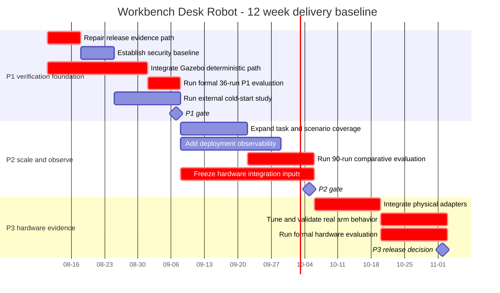

# 项目计划

基线日期：2026-08-11。该进度表是计划基线，不是任务已开始或已完成的证明。

## 里程碑与闸门

| 闸门 | 计划日期 | 进入依赖 | 退出标准 | 当前状态 |
|---|---|---|---|---|
| P1 | 2026-09-07 | 集成的确定性 Gazebo 路径 | 虚假完成 0、碰撞 0、抓取 >=90%、VTCR >=80%、36 次正式运行、外部复现 >=2/3 | NOT_READY |
| P2 | 2026-10-05 | P1 闸门加扩展的任务/场景集 | >=3 种任务类型、30 个场景、90 次正式运行、P95 <60s、硬件输入已冻结 | NOT_READY |
| P3 | 2026-11-02 | 物理适配器与独立急停 | 真实虚假完成 0、碰撞 0、抓取 >=70%、>=30 次真实运行、契约变更 0 | NOT_READY |

## 关键依赖

| 依赖 | 消费方 | 控制手段 |
|---|---|---|
| 仿真世界与机械臂组合 | 正式 P1 评估 | 在安排闸门评审前，要求可复现的启动命令与原始 Gazebo 日志 |
| 冻结的 schema 与匹配的 Pydantic 模型 | 所有生产者与消费者 | 同 PR 内三位 Owner 批准加 `make contract` |
| 注明日期的报价、已批准的 AVL 与来料检验 | 硬件订购与 P3 | 在外部记录存在前保持订单发布受阻 |
| 外部参与者记录 | 可复现性声明 | 保留所有失败并验证参与者唯一性 |
| 人类主导的发布/tag 决策 | 发布 | AI 与 CI 准备证据，但绝不生成该决策 |

每次周会对照本基线衡量进度偏差。证据缺失改变的是闸门状态，而不是历史基线。
