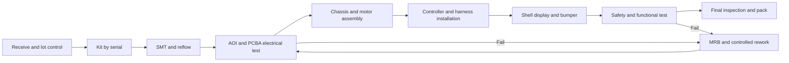

# 组装作业指导书

## 流程路线

流程路线与工时的真实来源是 `routing.csv`。以下指导书是对图纸的补充，绝不覆盖
图纸公差或安全要求。

## 工位作业指导

1. **收货 / 配料：**隔离无标签物料。核验料号、版本、批次、数量、损伤、供应商
   声明与湿敏等级状态。只有在 BOM 版本与工单一致后，才打印序列化随工单。
2. **SMT / 回流焊：**核验钢网版本与锡膏有效期；记录首件锡膏覆盖率。加载已批准
   的质心/BOM。运行锁定的 SAC305 温度曲线；没有 ECN 不得手工修改贴装位置。将
   首件单独隔离供 AOI 检查。
3. **PCBA 检验 / 测试：**检查极性、桥连、立碑、对空洞敏感的电源焊盘，以及 8 mm
   隔离屏障。在防护罩后方以限流的 36 V 输入进行测试，然后测量 12V_ISO、
   JETSON_12V、3.3 V、纹波、隔离、急停输入与 CAN。
4. **机箱：**先松装电机支架，以基准固定装置为参考，将 M3 钢制紧固件拧至
   0.55 N m、带标记的塑料紧固件拧至 0.25 N m，除非图纸另有规定。记录校准扭矩后
   施加点检标记。
5. **控制器 / 保护接地：**安装支撑柱、板卡、绝缘屏障与保护/机箱接地。使用四线
   补偿法测量接地电阻，要求低于 0.10 欧姆。任何线束都不得被压在 PCB 下方或
   接触锐边。
6. **线束：**只对插匹配的防呆连接器；确认两级锁扣均已扣合。保持 5 mm 边缘净空、
   弯曲半径规则、服务环，以及 48 V、开关节点、CAN 与 ADC 布线的相互分离。线规、
   长度、颜色、屏蔽与弯曲半径以 `harness-spec.csv` 为准。在导通测试之前安装应力
   消除装置。
7. **外壳 / 显示屏：**清洁显示窗口，按 8 度基准安装其支架，进行间隙/齐平度检查，
   安装 TPU 防撞条，并确认散热孔无遮挡。不得在受控点胶图纸范围之外使用胶粘剂。
8. **安全 / 功能：**在车轮受约束的情况下，核验断电、输入电流、电源轨时序、急停
   跳闸与闭锁复位、两端 CAN、传感器、显示屏、电机使能互锁，以及 30 分钟热浸泡。
   按序列号存储固定装置的原始 JSON。
9. **终检 / 包装：**核查紧固件标记、标签、外观区域、证据记录、附件、运输锁止件、
   所需的干燥剂/湿度指示卡与纸箱 ID。

## 停线条件

出现以下任一情况即停线：急停失败、隔离屏障污染、保护接地失败、冒烟/异味、
连续三台出现相同的重复缺陷、图纸版本不明、校准过期，或缺陷从更早的闸门逃逸。
